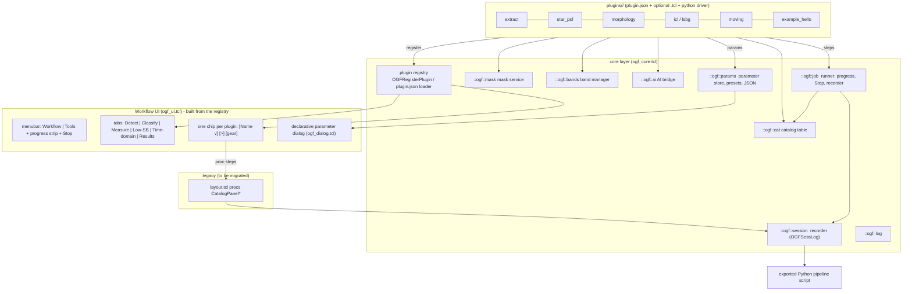

# OGFinder architecture

Status: stages (a) and (b) of the restructuring are implemented (core layer, plugin registry, declarative dialog,
workflow tabs, image tab strip with Tile/Single, one time-domain table); stage (c) (moving feature code out of
`layout.tcl` into `plugins/`) is done for Moving, AI services, Bands and Mask and **not** for the rest (section 6).
Sections 1-4 are an audit of the code *before* the restructuring (all numbers measured on the tree at commit `d6d9dff82`,
`layout.tcl` = 12958 lines); section 5 describes the target architecture and what is implemented;
section 6 is the remaining migration plan.  Tables marked "generated" come from `tools/` scripts that parse the Tcl
sources and the `plugin.json` manifests, not from memory.

## 1. Files and sizes (before)

| File | lines | role |
|---|---|---|
| `ds9/library/layout.tcl` | 12958 | DS9 window layout **and** the whole catalog panel: 250 procs, 11 menus, extraction, table, markers, PSF, ICL, LSBG, ... |
| `ogf_session.tcl` (+ `ogf_session_template.py`) | 594 (+1409) | session recorder `OGFSessLog`, export of the GUI session as a Python pipeline script |
| `ogf_moving.tcl` (now `plugins/moving/moving.tcl`) | 582 | Moving Objects menu, dialogs, tables, orbit window |
| `ogf_ai.tcl` (now `plugins/ai_services/ai.tcl`) | 566 | AI service bridge GUI |
| `ogf_mask.tcl` (now `plugins/mask/mask.tcl`) | 539 | shared mask manager |
| `ogf_bands.tcl` (now `plugins/bands/bands.tcl`) | 475 | multi-band registry, forced photometry, tile view |
| `ogf_link.tcl` | 398 | image <-> table link (click, hover, multi-select, keys) |
| `ogf_util.tcl` | 103 | `OGFPython`, `OGFForm`, `OGFTextWindow`, ... |

Python back ends are `ds9/library/ds9_*.py` (one per computational feature) plus the packages `moving/`,
`ai_bridge/`, `icl/`, `lsbg/`, `sersic_fit/`, ... at the repository root; the C binary `bin/ds9_sextract`.

## 2. Menus (before)

The catalog panel had a flat menubar of **11 top-level menus** (`SExtractor, Objects, Galaxy Model, Star(PSF),
Deconvolution, Bands, Mask, ICL, LSBG, Analysis, Moving Objects`) which requested 620 px and so fixed the width of the
right pane; next to the 12 standard DS9 menus of the left pane.  Generated inventory (measured by walking the real
menu widgets in a running ds9, `fits/menu_baseline.tsv`):

| Old top-level menu | leaf entries | procs behind them (first ones) |
|---|---|---|
| Analysis | 19 | CatalogPanelMorphometry, CatalogPanelSersicFit, CatalogPanelPSFPhotometry, CatalogPanelMultiBand, CatalogPanelCrowdedPhot, CatalogPanelCrossMatch ... |
| Bands | 10 | CatalogPanelBandsRegister, CatalogPanelBandsLoad, CatalogPanelBandsList, CatalogPanelBandsDetect, CatalogPanelBandsMeasure, CatalogPanelBandsTile ... |
| Deconvolution | 9 | CatalogPanelDeconvolve, CatalogPanelDeconvSettings, CatalogPanelQuickDeconvolve |
| Objects | 10 | CatalogPanelMarkAll, CatalogPanelClearMarkers, CatalogPanelShowVisible, CatalogPanelDeleteSelected, CatalogPanelSeparateSelected, CatalogPanelSeparateSettings ... |
| Galaxy Model | 4 | CatalogPanelGalaxyMorphology, CatalogPanelGalaxyFit, CatalogPanelGalaxyParams |
| ICL | 20 | CatalogPanelICLMask, CatalogPanelICLViewMask, CatalogPanelICLSaveMask, CatalogPanelICLImportMask, CatalogPanelICLBackground, CatalogPanelICLViewBkg ... |
| LSBG | 20 | CatalogPanelLSBGMask, CatalogPanelLSBGViewMask, CatalogPanelLSBGSaveMask, CatalogPanelLSBGImportMask, CatalogPanelLSBGClean, CatalogPanelLSBGViewClean ... |
| Mask | 15 | CatalogPanelMaskAuto, CatalogPanelMaskToggleOverlay, CatalogPanelMaskOverlaySettings, CatalogPanelMaskRegions, CatalogPanelMaskGrow, CatalogPanelMaskSimple ... |
| Moving Objects | 13 | OGFMovFetchDialog, OGFMovAlign, OGFMovDifference, OGFMovDetect, OGFMovLink, OGFMovIdentify ... |
| SExtractor | 10 | CatalogPanelToggleDetach, CatalogPanelExtract, CatalogPanelDualExtract, CatalogPanelSettingsDialog, CatalogPanelTrimDialog, CatalogPanelSaveCatalog ... |
| Star(PSF) | 17 | CatalogPanelFindStars, CatalogPanelShowStars, CatalogPanelClearStars, CatalogPanelBuildPSF, CatalogPanelBuildExtendedPSF, CatalogPanelSimPSFWebbPSF ... |

## 3. Procs per feature (before; line ranges in `layout.tcl` unless another file is named)

Generated by `tools/audit.py` (proc-name groups; `ds9-layout` is the rest of the file: canvas, view/tile layout,
theme glue).  Ranges are inclusive line numbers of `proc` bodies in the baseline tree.

| Feature (proc group) | File | Line range(s) in file | procs | lines |
|---|---|---|---|---|
| ds9-layout | layout.tcl | 7-1027, 3622-4705 | 43 | 2105 |
| ds9-layout | ogf_bands.tcl | 17-93, 120-133, 243-247 | 8 | 96 |
| ds9-layout | ogf_link.tcl | 24-190, 219-281, 296-302, 346-374 | 17 | 266 |
| ds9-layout | ogf_session.tcl | 228-235, 334-376 | 4 | 51 |
| ds9-layout | ogf_util.tcl | 8-104 | 5 | 97 |
| catalog-core | layout.tcl | 1028-1046, 1162-1464, 1475-1709, 1906-2469, 2763-2780, 3203-3317 ... | 40 | 1795 |
| catalog-core | ogf_bands.tcl | 301-307 | 1 | 7 |
| catalog-core | ogf_link.tcl | 191-218, 282-295, 303-345, 375-399 | 7 | 110 |
| extract | layout.tcl | 1047-1161, 1465-1474, 1710-1905, 8511-8608 | 8 | 419 |
| merge | layout.tcl | 2470-2762, 2781-2823 | 3 | 336 |
| ai-merge | layout.tcl | 2824-3202 | 9 | 379 |
| trim | layout.tcl | 3318-3621 | 6 | 304 |
| galaxy-model | layout.tcl | 4706-5096 | 6 | 391 |
| star-psf | layout.tcl | 5097-6526, 6671-6890, 8224-8277 | 29 | 1704 |
| deconv | layout.tcl | 6527-6670, 6891-7040 | 8 | 294 |
| separate/edit | layout.tcl | 7041-7716 | 12 | 676 |
| icl | layout.tcl | 7755-7778, 8697-8743, 8994-9060, 9145-9148, 9594-9597, 9604-10690 | 32 | 1233 |
| lsbg | layout.tcl | 7779-7803, 9061-9144, 9149-9156, 9598-9603, 10691-11946 | 23 | 1379 |
| measure-misc | layout.tcl | 8070-8223, 8278-8510, 8609-8696 | 7 | 475 |
| cli-script | layout.tcl | 8744-8993, 9157-9593 | 4 | 687 |
| plot/viewer | layout.tcl | 12184-12447, 12783-12818 | 7 | 300 |
| photo-z | layout.tcl | 12448-12597 | 4 | 150 |
| sed | layout.tcl | 12598-12782 | 4 | 185 |
| bulge-disk | layout.tcl | 12819-12959 | 5 | 141 |
| ai-services | ogf_ai.tcl | 24-567 | 27 | 544 |
| bands | ogf_bands.tcl | 9-16, 94-119, 134-242, 248-300, 308-476 | 21 | 365 |
| link | ogf_link.tcl | 7-23 | 1 | 17 |
| mask | ogf_mask.tcl | 9-540 | 34 | 532 |
| moving | ogf_moving.tcl | 9-583 | 42 | 575 |
| sessionlog | ogf_session.tcl | 14-227, 236-333, 377-595 | 29 | 531 |

Note the interleaving: ICL and LSBG procs are scattered over 7755-11946 because the CLI export/import code
(`CatalogPanelExportCLIScript`, `CatalogPanelImportCLIScript`, 8744-9593) and the shared helpers sit between them.

## 4. Coupling

### 4.1 Global `catpanel(...)` variables per feature

One array (`::catpanel`) holds *everything*: table state, per-feature parameters, status text, selection.  Generated
from the proc bodies (`set catpanel(x,...)` = write, any `catpanel(x,...)` = read):

| `catpanel(<prefix>,...)` | written by | read by |
|---|---|---|
| `alldata` | catalog-core, cli-script, ds9-layout, galaxy-model, lsbg, merge, separate/edit | ai-merge, ai-services, bands, bulge-disk, catalog-core, cli-script, deconv, ds9-layout, extract, galaxy-model, icl, link, lsbg, mask, measure-misc, merge, photo-z, plot/viewer, sed, separate/edit, sessionlog, star-psf, trim |
| `tbl` | ds9-layout | catalog-core, ds9-layout, extract, link, merge, separate/edit |
| `tbldb` | ds9-layout | catalog-core, ds9-layout, merge, separate/edit |
| `sel` | catalog-core, ds9-layout, link | ai-services, bands, catalog-core, ds9-layout, link |
| `hover` | catalog-core, ds9-layout, link | catalog-core, ds9-layout, link |
| `cache` | ds9-layout, link | catalog-core, ds9-layout, link |
| `status` | ai-merge, ai-services, bands, bulge-disk, catalog-core, cli-script, deconv, ds9-layout, extract, galaxy-model, icl, lsbg, mask, measure-misc, merge, moving, photo-z, plot/viewer, sed, separate/edit, sessionlog, star-psf, trim | ai-merge, ai-services, bands, bulge-disk, catalog-core, cli-script, deconv, ds9-layout, extract, galaxy-model, icl, lsbg, mask, measure-misc, merge, moving, photo-z, plot/viewer, sed, separate/edit, sessionlog, star-psf, trim |
| `param` | bands, extract | bands, bulge-disk, extract, icl, lsbg, mask, measure-misc, merge, photo-z, sed, separate/edit, sessionlog, star-psf |
| `psf` | catalog-core, ds9-layout, star-psf | bulge-disk, catalog-core, deconv, ds9-layout, measure-misc, star-psf |
| `icl` | catalog-core, cli-script, ds9-layout, icl | catalog-core, cli-script, ds9-layout, icl, mask |
| `lsbg` | catalog-core, cli-script, ds9-layout, lsbg | catalog-core, cli-script, ds9-layout, lsbg, mask |
| `markall` | catalog-core, ds9-layout, galaxy-model, star-psf | catalog-core, ds9-layout, galaxy-model, separate/edit, star-psf |
| `merge` | ai-merge, catalog-core, ds9-layout, merge | ai-merge, catalog-core, ds9-layout, merge |
| `ai` | ai-merge, catalog-core, ds9-layout | ai-merge, catalog-core, ds9-layout |
| `trim` | catalog-core, ds9-layout, trim | catalog-core, ds9-layout, trim |
| `visible_mode` | catalog-core, ds9-layout | catalog-core, ds9-layout |
| `add_objects_mode` | catalog-core, ds9-layout | catalog-core, ds9-layout, separate/edit |
| `sort` | catalog-core, ds9-layout | catalog-core, ds9-layout |
| `filename` | catalog-core, ds9-layout | catalog-core, ds9-layout |
| `detached` | catalog-core, ds9-layout | catalog-core, ds9-layout, extract |
| `photoz` | ds9-layout, photo-z | ds9-layout, photo-z |
| `sed` | ds9-layout, sed | ds9-layout, sed |
| `bd` | bulge-disk, ds9-layout | bulge-disk, ds9-layout |
| `plot` | ds9-layout, plot/viewer | ds9-layout, plot/viewer |
| `morph` | catalog-core, galaxy-model | catalog-core, galaxy-model |

Observations (all from the table above):
* `catpanel(status)` is written by every feature (23 groups) - there is no status service.
* `catpanel(alldata)` (the catalog as one TSV string) is read by 20 groups and written by 7: catalog access is
  direct string parsing in each feature.  `ogf_link.tcl` additionally keeps a parsed cache keyed on a write trace.
* `catpanel(icl,*)` / `catpanel(lsbg,*)` are read by the **mask** manager (`OGFMaskInit` copies defaults from
  `icl,param,*`; `OGFMaskAfterEdit` sets `icl,has_mask` / `lsbg,has_mask`), i.e. the supposedly shared mask service is
  coupled to two pipelines.
* `catpanel(psf,*)` is read by Deconvolution, Bulge+Disk, PSF photometry (state of the Star/PSF feature).
* Parameters of each feature live in `catpanel(<f>,param,<name>)` with a hand-written `*ParamLoad/*ParamSave`
  pair and a hand-written settings dialog (9 dialogs, 3 shapes: `ed()` copy + Apply, `ttk::spinbox` + OK, `OGFForm`).

### 4.2 Calls between features (excluding the catalog core, session recorder and the menu code in `layout.tcl`)

| Feature | reaches into | via |
|---|---|---|
| ds9-layout | extract | `CatalogPanelDualExtract`, `CatalogPanelExtract`, `CatalogPanelParamDef`, `CatalogPanelSettingsDialog` |
| ds9-layout | trim | `CatalogPanelTrimDialog` |
| ds9-layout | separate/edit | `CatalogPanelDeleteSelected`, `CatalogPanelSeparateLoad`, `CatalogPanelSeparateSave`, `CatalogPanelSeparateSelected` ... |
| ds9-layout | ai-merge | `CatalogPanelAIMerge` |
| ds9-layout | galaxy-model | `CatalogPanelGalaxyFit`, `CatalogPanelGalaxyMorphology`, `CatalogPanelGalaxyParams` |
| ds9-layout | star-psf | `CatalogPanelBuildExtendedPSF`, `CatalogPanelBuildPSF`, `CatalogPanelClearStars`, `CatalogPanelFindStars` ... |
| ds9-layout | deconv | `CatalogPanelDeconvSettings`, `CatalogPanelDeconvolve`, `CatalogPanelQuickDeconvolve` |
| ds9-layout | bands | `CatalogPanelBandsDetect`, `CatalogPanelBandsList`, `CatalogPanelBandsLoad`, `CatalogPanelBandsMeasure` ... |
| ds9-layout | mask | `CatalogPanelMaskAuto`, `CatalogPanelMaskCopyToBands`, `CatalogPanelMaskGrow`, `CatalogPanelMaskImport` ... |
| ds9-layout | icl | `CatalogPanelICLBackground`, `CatalogPanelICLColorProfile`, `CatalogPanelICLDecompose`, `CatalogPanelICLExportScript` ... |
| ds9-layout | lsbg | `CatalogPanelLSBGClean`, `CatalogPanelLSBGDetect`, `CatalogPanelLSBGExportScript`, `CatalogPanelLSBGFilter` ... |
| ds9-layout | measure-misc | `CatalogPanelCompleteness`, `CatalogPanelCrossMatch`, `CatalogPanelCrowdedPhot`, `CatalogPanelMorphometry` ... |
| ds9-layout | plot/viewer | `CatalogPanelAnalysisViewer`, `CatalogPanelPlotDialog` |
| ds9-layout | photo-z | `CatalogPanelPhotoZ`, `CatalogPanelPhotoZParamLoad` |
| ds9-layout | sed | `CatalogPanelSEDFit`, `CatalogPanelSEDParamLoad` |
| ds9-layout | bulge-disk | `CatalogPanelBDParamLoad`, `CatalogPanelBulgeDisk` |
| ds9-layout | ai-services | `OGFAIBuildMenu` |
| ds9-layout | moving | `OGFMovingInit`, `OGFMovingMenu` |
| ds9-layout | merge | `CatalogPanelMergeSources` |
| ds9-layout | link | `OGFLinkInit` |
| catalog-core | ai-merge | `CatalogPanelAIDone`, `CatalogPanelAIUnbindKeys` |
| catalog-core | merge | `CatalogPanelMergeCancel` |
| catalog-core | bands | `OGFBandsShareCatalog` |
| extract | merge | `CatalogPanelMergeSources`, `CatalogPanelSetLogScale` |
| ai-merge | extract | `CatalogPanelExtract` |
| ai-merge | merge | `CatalogPanelMergeSources` |
| galaxy-model | ai-services | `OGFAIBackendHook` |
| star-psf | ai-services | `OGFAIBackendHook` |
| deconv | star-psf | `CatalogPanelBuildPSF`, `CatalogPanelFindStars`, `CatalogPanelPSFGetFITS`, `CatalogPanelPSFGetScript` ... |
| separate/edit | extract | `CatalogPanelParamSave` |
| icl | mask | `CatalogPanelMaskImport`, `CatalogPanelMaskSaveAs`, `CatalogPanelMaskToggleOverlay`, `OGFMaskBoolPath` ... |
| lsbg | mask | `CatalogPanelMaskImport`, `CatalogPanelMaskSaveAs`, `CatalogPanelMaskToggleOverlay`, `OGFMaskEnsure` ... |
| cli-script | icl | `CatalogPanelICLUpdateFiles` |
| cli-script | lsbg | `CatalogPanelLSBGUpdateFiles` |
| photo-z | ai-services | `OGFAIBackendHook` |
| sed | ai-services | `OGFAIBackendHook` |
| ai-services | bands | `OGFBandsSorted` |
| bands | extract | `CatalogPanelExtract` |
| mask | icl | `CatalogPanelICLUpdateFiles` |
| mask | lsbg | `CatalogPanelLSBGUpdateFiles` |
| sessionlog | mask | `OGFMaskRun` |

Plus: `ds9.tcl` creates `ds9(catalog_frame)`; `frame.tcl` calls `CatalogPanelHover/LinkPress/LinkShiftClick/
LinkRelease/StepKey` (the image <-> table link entry points).  The four AI-capable steps (`CatalogPanelGalaxyMorphology`,
`CatalogPanelStarFinder`, `CatalogPanelPhotoZ`, `CatalogPanelSEDFit`) start with
`if {[OGFAIBackendHook ...]} return` - the AI bridge hooks into other features by name.

### 4.3 Session recorder classification (AUTO / CONFIG / MANUAL)

`OGFSessLog STEP CLASS ARGV ...` is called from 41 places.  AUTO steps are replayed by the exported script in
`--mode pipeline` on new data, CONFIG steps (band registration) only in replay mode, MANUAL steps (hand edits, BCG
centre pick, ...) only with `--include-manual` / replay.  Generated from the manifests (`session` field was
transcribed from the `OGFSessLog` call sites above, see the `records` column for the recorder step names):

| Plugin | Step | Recorder step name(s) | Class | Proc / CLI |
|---|---|---|---|---|
| ai_services | Service Registry... | - | NONE | `OGFAIRegistry` |
| ai_services | Run Task on Catalog... | ai.run | AUTO | `OGFAIRunDialog` |
| ai_services | Show Last Run Log | - | NONE | `OGFAIShowLog` |
| bands | Register Current Frame as Band... | bands.register | CONFIG | `CatalogPanelBandsRegister` |
| bands | Load Band... | bands.register | CONFIG | `CatalogPanelBandsLoad` |
| bands | Detection Band... | bands.detect | CONFIG | `OGFUIBandMenu detect` |
| bands | Remove Band... | bands.remove | CONFIG | `OGFUIBandMenu remove` |
| bands | List Bands... | - | NONE | `CatalogPanelBandsList` |
| bands | Detect in Detection Band | extract | AUTO | `CatalogPanelBandsDetect` |
| bands | Measure in All Bands... | bands.measure | AUTO | `CatalogPanelBandsMeasure` |
| bands | Tile Bands | - | NONE | `CatalogPanelBandsTile` |
| bands | Single Frame View | - | NONE | `CatalogPanelBandsSingleView` |
| bands | Copy Mask to Other Bands | mask.copy_to_bands | AUTO | `CatalogPanelMaskCopyToBands` |
| catalog | Save Catalog | catalog.save | AUTO | `CatalogPanelSaveCatalog` |
| catalog | Export Regions (.reg) | - | NONE | `CatalogPanelExportRegions` |
| catalog | Export FITS Table | catalog.export_fits | AUTO | `CatalogPanelExportFITS` |
| catalog | Load Catalog | catalog.load | MANUAL | `CatalogPanelLoadCatalog` |
| catalog | Clear | catalog.clear | MANUAL | `CatalogPanelClear` |
| catalog | Interactive Plot... | - | NONE | `CatalogPanelPlotDialog` |
| catalog | Analysis Viewer... | - | NONE | `CatalogPanelAnalysisViewer` |
| deconv | Deconvolve | deconv.run | AUTO | `CatalogPanelDeconvolve rl, CatalogPanelDeconvolve rl_accelerated ...` |
| deconv | Quick Deconvolve (RL) | deconv.run | AUTO | `CatalogPanelQuickDeconvolve` |
| extract | Extract | extract | AUTO | `CatalogPanelExtract` |
| extract | Dual-Image Extract... | analysis.dual_extract | AUTO | `CatalogPanelDualExtract` |
| extract | Trim catalog... | catalog.trim | AUTO | `CatalogPanelTrimDialog` |
| galaxy_model | AI Morphology Classification | galaxy.morphology, ai.run | AUTO | `CatalogPanelGalaxyMorphology` |
| galaxy_model | Fit Galaxy Model | - | NONE | `CatalogPanelGalaxyFit elliptical, CatalogPanelGalaxyFit spiral` |
| galaxy_model | Extract Parameters | - | NONE | `CatalogPanelGalaxyParams` |
| icl | 1. Source Masking (shared mask) | mask.auto | AUTO | `CatalogPanelICLMask` |
| icl | Show Mask Overlay | - | NONE | `CatalogPanelICLViewMask` |
| icl | Save Mask As... | - | NONE | `CatalogPanelICLSaveMask` |
| icl | Import Mask... | - | MANUAL | `CatalogPanelICLImportMask` |
| icl | 2. Background Model | icl.background | AUTO | `CatalogPanelICLBackground polynomial, CatalogPanelICLBackground chebyshev ...` |
| icl | View Background | - | NONE | `CatalogPanelICLViewBkg` |
| icl | 3. Set BCG Center | - | MANUAL | `CatalogPanelICLSetCenter` |
| icl | Measure Profile | icl.profile | AUTO | `CatalogPanelICLProfile` |
| icl | Sector Profile... | - | NONE | `CatalogPanelICLSectorProfile` |
| icl | 4. ICL Measurements | icl.measure | AUTO | `CatalogPanelICLMeasure` |
| icl | Multi-Threshold ICL | icl.measure-multi | AUTO | `CatalogPanelICLMeasureMulti` |
| icl | 5. BCG+ICL Decomposition | icl.decompose | AUTO | `CatalogPanelICLDecompose` |
| icl | Color Profile... | icl.color | AUTO | `CatalogPanelICLColorProfile` |
| icl | Save Profile... | - | NONE | `CatalogPanelICLSaveProfile` |
| icl | Load Profile... | - | NONE | `CatalogPanelICLLoadProfile` |
| icl | Export Script... | - | NONE | `CatalogPanelICLExportScript` |
| icl | Import Script... | - | NONE | `CatalogPanelICLImportScript` |
| icl | ICL Settings... | - | NONE | `CatalogPanelICLSettings` |
| lsbg | 1. Mask Bright Sources (shared mask) | mask.auto | AUTO | `CatalogPanelLSBGMask` |
| lsbg | Show Masked Image | - | NONE | `CatalogPanelLSBGViewMask` |
| lsbg | Save Mask As... | - | NONE | `CatalogPanelLSBGSaveMask` |
| lsbg | Import Mask... | - | MANUAL | `CatalogPanelLSBGImportMask` |
| lsbg | 2. Background Model | lsbg.clean | AUTO | `CatalogPanelLSBGClean sep_large, CatalogPanelLSBGClean polynomial ...` |
| lsbg | View Cleaned Image | - | NONE | `CatalogPanelLSBGViewClean` |
| lsbg | 3. Detect LSBG Candidates | lsbg.detect | AUTO | `CatalogPanelLSBGDetect` |
| lsbg | 4. Photometry | lsbg.photometry | AUTO | `CatalogPanelLSBGPhotometry` |
| lsbg | 5. Sersic Profile Fit | lsbg.sersic | AUTO | `CatalogPanelLSBGSersic` |
| lsbg | 6. Filter + Grade | lsbg.filter | AUTO | `CatalogPanelLSBGFilter` |
| lsbg | 7. SVM Classify | lsbg.svm-classify | AUTO | `CatalogPanelLSBGSVMClassify` |
| lsbg | Save Catalog... | catalog.save | AUTO | `CatalogPanelSaveCatalog` |
| lsbg | Load Catalog... | catalog.load | MANUAL | `CatalogPanelLoadCatalog` |
| lsbg | 8. Forced Photometry (Multi-Band) | lsbg.forced | MANUAL | `CatalogPanelLSBGForcedPhot` |
| lsbg | Run Full Pipeline | lsbg.run | AUTO | `CatalogPanelLSBGRunAll` |
| lsbg | Export Script... | - | NONE | `CatalogPanelLSBGExportScript` |
| lsbg | Import Script... | - | NONE | `CatalogPanelLSBGImportScript` |
| lsbg | LSBG Settings... | - | NONE | `CatalogPanelLSBGSettings` |
| mask | Auto Mask... | mask.auto | AUTO | `CatalogPanelMaskAuto` |
| mask | Show Mask Overlay | - | NONE | `CatalogPanelMaskToggleOverlay` |
| mask | Overlay Colour/Transparency... | - | NONE | `CatalogPanelMaskOverlaySettings` |
| mask | Edit Mask | mask.add, mask.erase, mask.grow, mask.shrink, mask.invert, mask.clear, mask.undo, mask.redo | MANUAL | `CatalogPanelMaskRegions 0, CatalogPanelMaskRegions 1 ...` |
| mask | Save Mask As... | mask.export | AUTO | `CatalogPanelMaskSaveAs` |
| mask | Import Mask... | mask.import | MANUAL | `CatalogPanelMaskImport` |
| mask | Show Masked Image | mask.masked | AUTO | `CatalogPanelMaskShowMasked` |
| mask | Mask Statistics | - | NONE | `CatalogPanelMaskStats` |
| morphology | Sersic Fitting | analysis.sersic | AUTO | `CatalogPanelSersicFit` |
| morphology | Non-Parametric Morphology (CAS/Gini/M20) | analysis.morphometry | AUTO | `CatalogPanelMorphometry` |
| morphology | Bulge+Disk Decomposition | analysis.bulge_disk | AUTO | `CatalogPanelBulgeDisk` |
| moving | Fetch Reference... | moving.fetch | AUTO | `OGFMovFetchDialog` |
| moving | Align | moving.align | AUTO | `OGFMovAlign` |
| moving | Difference | moving.difference | AUTO | `OGFMovDifference` |
| moving | Detect | - | NONE | `OGFMovDetect` |
| moving | Link Tracklets | moving.link | AUTO | `OGFMovLink` |
| moving | Identify Known Objects | moving.identify | AUTO | `OGFMovIdentify` |
| moving | Orbit Fit... | moving.orbit | AUTO | `OGFMovOrbitDialog` |
| moving | Transient Candidates... | moving.transients | AUTO | `OGFMovTransients` |
| moving | Light Curve | moving.lightcurve | AUTO | `OGFMovLightCurve` |
| moving | Export... | moving.export | AUTO | `OGFMovExport` |
| moving | Select Exposures... | - | NONE | `OGFMovSelectFiles` |
| moving | Work Directory... | - | NONE | `OGFMovWorkdir` |
| moving | Time-domain details... | - | NONE | `OGFMovDetails` |
| objects | Mark All | - | NONE | `CatalogPanelMarkAll` |
| objects | Clear Markers | - | NONE | `CatalogPanelClearMarkers` |
| objects | Show Visible Only | catalog.unrecorded | MANUAL | `CatalogPanelShowVisible` |
| objects | Add Objects (Click + A) | catalog.add_object | MANUAL | `(cli)` |
| objects | Delete Selected (Click + D) | catalog.delete | MANUAL | `CatalogPanelDeleteSelected` |
| objects | Separate Selected (Click + S) | catalog.separate | MANUAL | `CatalogPanelSeparateSelected` |
| objects | Save Separated Catalog... | - | NONE | `CatalogPanelSeparateSave` |
| objects | Load Separated Catalog... | - | MANUAL | `CatalogPanelSeparateLoad` |
| objects | AI Merge... | catalog.merge | MANUAL | `CatalogPanelAIMerge` |
| photometry | PSF Photometry | analysis.psf_phot | AUTO | `CatalogPanelPSFPhotometry` |
| photometry | Multi-Band Photometry... | analysis.multiband | AUTO | `CatalogPanelMultiBand` |
| photometry | Crowded Field Photometry | analysis.crowded_phot | AUTO | `CatalogPanelCrowdedPhot` |
| photometry | Cross-Match (VizieR)... | analysis.crossmatch | AUTO | `CatalogPanelCrossMatch` |
| photometry | Segmentation Map | analysis.segmap | AUTO | `CatalogPanelSegmentationMap` |
| photometry | Completeness Simulation... | analysis.completeness | AUTO | `CatalogPanelCompleteness` |
| photoz_sed | Photo-z (AI)... | analysis.photo_z, ai.run | AUTO | `CatalogPanelPhotoZ` |
| photoz_sed | SED Fitting (AI)... | analysis.sed_fit, ai.run | AUTO | `CatalogPanelSEDFit` |
| session | Save Session as Python Script... | - | NONE | `CatalogPanelSessionSave` |
| session | Show Session Log | - | NONE | `CatalogPanelSessionShow` |
| session | Reset Session Log | - | NONE | `CatalogPanelSessionReset` |
| star_psf | Find Stars | psf.find_stars | AUTO | `CatalogPanelFindStars combined, CatalogPanelFindStars class_star ...` |
| star_psf | AI Star Classification | stars.classify, ai.run | AUTO | `CatalogPanelStarFinder` |
| star_psf | Show Stars | - | NONE | `CatalogPanelShowStars` |
| star_psf | Clear Stars | - | NONE | `CatalogPanelClearStars` |
| star_psf | Build PSF | psf.build | AUTO | `CatalogPanelBuildPSF median, CatalogPanelBuildPSF moffat ...` |
| star_psf | Extended PSF... | psf.build_extended | AUTO | `CatalogPanelBuildExtendedPSF` |
| star_psf | WebbPSF (JWST)... | psf.webbpsf | AUTO | `CatalogPanelSimPSFWebbPSF` |
| star_psf | TinyTim (HST)... | psf.tinytim | AUTO | `CatalogPanelSimPSFTinyTim` |
| star_psf | View PSF | - | NONE | `CatalogPanelViewPSF` |
| star_psf | Save PSF... | - | NONE | `CatalogPanelSavePSF` |
| star_psf | Load PSF... | - | NONE | `CatalogPanelLoadPSF` |
| star_psf | PSF / Star Settings... | - | NONE | `CatalogPanelStarPSFSettings` |

## 5. Target architecture

### 5.1 What exists now

* `ogf_json.tcl` - JSON reader (the embedded Tcl has no tcllib json; also accepts the `NaN`/`Infinity` Python writes).
* `ogf_core.tcl` - logging, the services `::ogf::cat/mask/bands/session/ai`, `::ogf::job`, `::ogf::params`,
  `::ogf::reg` (registry: discovery of `plugins/*/plugin.json`, validation, enable/disable, `OGFRegisterPlugin`,
  `"required": 1` plugins cannot be disabled), `::ogf::step` (argv templating incl. `{plugin_dir}`, running a plugin
  step through the job runner and the recorder, stage progress).
* `ogf_dialog.tcl` - `OGFParamDialog`: one dialog builder for all parameter specs (groups, Basic/Expert, tabs, validation,
  presets, Reset, Apply/OK).  Used by extract, deconv, morphology (bulge+disk), star-psf, objects, ICL, LSBG, mask overlay,
  AI services, example_hello.
* `ogf_pick.tcl` - click chooser for overlapping markers/rows (`docs/click_selection.md`).
* `ogf_ui.tcl` - menubar (`Workflow`, `Tools`), tab bar, plugin chips, progress strip + Stop.
* `ogf_tile.tcl` - the image tab strip with `Single` / `Tile` / `Layout` (section 5.4) and marker drawing in every tile.
* `ogf_td.tcl` - the time-domain table: kind registry, filter, sort, save, markers (section 5.3).
* `plugins/*/plugin.json` - 16 built-in plugins that describe every existing step (+ `example_hello`, disabled by
  default).  For the plugins that are not migrated the steps call the *existing* procs (thin wrappers): computation,
  CLI argv and recorder calls are untouched.
* Since section 6: the procs of every other feature live in `plugins/<id>/*.tcl` too (`layout.tcl` keeps only the panel
  construction, detach/layout code and ds9 core).
* `plugins/moving/moving.tcl`, `plugins/ai_services/ai.tcl`, `plugins/bands/bands.tcl`, `plugins/mask/mask.tcl` - the
  former `ogf_moving.tcl`, `ogf_ai.tcl`, `ogf_bands.tcl`, `ogf_mask.tcl`, moved with `git mv` (history kept) and sourced
  through the manifest's `"tcl"` field.  Their proc names are unchanged, so `layout.tcl`, the recorder and
  `scripts/verify_ai_gui.tcl` keep working.

### 5.2 Dependency rules

1. A plugin may call `::ogf::*` and its own procs.  It must not read `catpanel(...)`, `ogfmask(...)`, `ogfband(...)`
   directly (legacy procs still do; they are the migration backlog, section 6).
2. Core services may call legacy procs (they are adapters over `layout.tcl`/plugin files today), never plugins.
3. Everything the recorder must replay goes through `OGFSessLog` (directly or via `::ogf::job::run` /
   `::ogf::step::run`), so exported scripts stay valid.
4. The UI is generated from the registry; no UI code names a feature.

### 5.3 One table for galaxies and time-domain objects

`catpanel(alldata)` (the galaxy catalogue, used by every galaxy feature and by the recorder) is **never modified** by the
time-domain kinds.  `::ogf::td::register_kind` (called by the `moving` plugin's init for `moving`, `transient`,
`detection`) gives a kind a prefix, marker colour and column list; `::ogf::td::show KIND` fills the same Tktable with the
rows of that kind (`All` = galaxies + movers + transients, common columns plus `kind`).  Row selection, sort, filter and
Save use the same widgets and callbacks as for galaxies (non-galaxy sort/save are logged as informational `note` steps).
Extra columns: `host_id`/`host_sep` (transients, nearest galaxy within 5 arcsec), `overlap`/`overlap_id` (movers).
Markers are fk5 `point(...)` regions tagged `ogf_td`/`ogf_td.<KEY>` in every frame; selection reuses the `sextract_sel`
tag.  The table geometry (y=181, h=769, info 154) is the same in every view.

### 5.4 Image tabs and Tile (ds9's mosaic is kept)

`ogf_tile.tcl` adds a 24 px strip under the image canvas: one tab per frame (band name or file name; click = go to the
frame) and on the right `Single`, `Tile`, `Layout` (grid / column / row, lock pan-zoom by WCS, share scale limits) and a
frame list.  `Tile` is ds9's own one-canvas `tile` mode (`OGFUIDisplay tile`), `Single` returns to tab view
(`OGFUIDisplay single`); the right-click item *Tile all* calls the same function.  Catalog markers are drawn into every
registered band frame (`OGFMarkSend`/`OGFMarkDelete`, positions mapped with `OGFBandPos`) and a click on a marker in any
tile (`Button1Frame` -> `OGFTileClick`) selects the same table row.

### 5.5 Menus after

Top level of the catalogue panel: **Workflow | Tools** (+ the progress strip and Stop), then the 6 tabs
**Detect | Classify | Measure | Low-SB | Time-domain | Results**, each showing one chip `[Name v][>][gear]` per plugin.
Measured by walking the real menu widgets (`fits/menu_new3.tsv`, compared by `tools/compare_menus.py`): all 145 leaf
entries of the old 11 menus are reachable (144 as the same command, the old `Show Results Table` is replaced by the kind
filter of the shared table, the three old settings dialogs by `OGFParamDialog`); 23 entries are new (tabs, tile options,
plugin dialogs, details window).  Panel width is 559 px instead of 620 px.

### 5.6 Click selection

A click on overlapping markers/rows opens a chooser (ID, kind, mag, distance) instead of taking the topmost; a single hit selects the nearest row.  See `docs/click_selection.md`.

## 6. Migration status

`layout.tcl`: 12958 lines originally, 12198 after the first pass (moving, ai_services, bands, mask), **1873 now**.
Every feature procedure that a manifest wraps now lives in `plugins/<id>/*.tcl` (verbatim extraction; the proc inventory -
name, argument count, body CRC - of all 3726 procs is identical to the baseline except the dialog procs replaced below,
and it stays identical when `icl`, `lsbg`, `star_psf` or `catalog` is disabled, because the manifest field `tcl_always`
sources the procs of a disabled plugin).

| stage | commit | moved |
|---|---|---|
| 1 | `7aac298a7` | photo-z / SED, bulge+disk, morphology (Morphometry, Sersic), photometry, plot/viewer; loader: `tcl` may be a list, `tcl_always`, `source -encoding utf-8` |
| 2 | `d4c5ff2a6` | star-psf, deconv, galaxy-model |
| 3 | `39c3f714b` | extract (+ dual-image mode, trim), separate/edit, merge, AI-merge |
| 4 | `0d12f535d` | ICL, LSBG, cli-script (CLI export/import) |
| 5 | `5233a426f` | catalogue core: `catalog_io.tcl`, `catalog_table.tcl`, `catalog_markers.tcl`, auto-extract |
| 6 | `3ad107939` | hand-written settings dialogs -> declarative `OGFParamDialog`: star-psf (20 params, tabbed), objects (6), ICL (24, tabbed), LSBG (46, tabbed), mask overlay (2), AI services (5) |
| 7 | (this pass) | `ogf_pick.tcl`: click chooser for overlapping markers (section 5.6) |

After every stage `make` was rebuilt and the replay harness re-run (78 checks, 0 failed; step signatures of the GUI
sessions identical).  Table y / height / info area stayed 181 / 769 / 154, detach/reattach 1300x950 -> 736x950 -> 1300x950.

Dialog behaviour change (deliberate): **Reset** now restores the start-up defaults of the parameter, the old *Defaults*
buttons had a few different values (ICL expand-factor 1.5 vs 2.5, LSBG svm-threshold 0.3 vs 0.5).  Invalid input is
rejected with a message (e.g. "PSF size: integer expected").

### Not migrated, and why

| proc(s) | lines | reason |
|---|---|---|
| `CreateCatalogPanel` | ~365 | builds the panel and holds the initial `catpanel(...)` defaults; calls the `*ParamLoad` procs before `OGFCoreReady` - moving it changes start-up order |
| `CatalogPanelToggleDetach`, `SyncInfoHeight`, `RedrawTtk(+Do)` | | enforce the layout invariants (181/769/154) and touch the ds9 pane/canvas; kept in place on purpose |
| `CreateHeader`, `CanvasDef`/`BlinkDef`/`FadeDef`/`TileDef`/`ViewDef`, `CreateCanvas`, `Layout*`, `TileRect*`, `Process*Cmd`, `*Canvas` bindings, `DisplayDefaultDialog` | | these are ds9 itself (SAOImageDS9 core), not OGFinder features |

Coupling to the `catpanel(...)` global is addressed in section 7 (`::ogf::cat` accessor, done plugin by plugin); the `ed()`
dialog globals are not.

## 7. `::ogf::cat` key accessor (decoupling from `catpanel(...)`)

Migrated plugin code no longer touches the `catpanel` global.  It goes through `::ogf::cat` (`ds9/library/ogf_core.tcl`):

| call | meaning |
|---|---|
| `::ogf::cat::get KEY ?default?` | value; error if the key is unset and no default is given |
| `::ogf::cat::set KEY VALUE` / `exists` / `unset KEY...` / `unset_glob PAT` | write, test, remove |
| `::ogf::cat::append KEY ...` / `lappend KEY ...` | in-place string / list extension |
| `::ogf::cat::keys ?GLOB?` | existing keys |
| `::ogf::cat::trace add\|remove\|info KEY CMD` | `CMD KEY NEWVALUE` after every write of KEY, including writes by legacy code |
| `::ogf::cat::has` / `tsv` / `selection` | catalog loaded? / the whole catalog TSV / NUMBERs of the selected rows |
| `::ogf::cat::registry` / `describe KEY` | the documented key registry (below) |
| `::ogf::cat::cell ROW COL ?default?` / `cell_exists` / `header COL` / `table_col NAME` | one cell of the table now shown (row 0 = header; 1-based like Tk) |
| `::ogf::cat::table_ncols` / `table_nrows` / `row_of NUMBER` / `number_of ROW` | table size (data rows) and NUMBER <-> table row |
| `::ogf::cat::table_begin` / `table_put ROW FIELDS ?ncols?` / `table_end NCOLS NROWS ?opts?` / `table_reset` | the only way to (re)fill the table: unbind, store, rebind |
| `::ogf::cat::bind_var KEY` / `bump KEY ?n?` | variable name for a Tk `-variable` option; integer counter keys |
| `::ogf::cat::frame_get FRAME KEY ?default?` / `frame_set` / `frame_exists` / `frame_delete` | the per-frame snapshots (`catpanel_fdata`) |

KEY is exactly the old array subscript (`param,detect-thresh`, `icl,center_x`, ...), and the storage is still the global
`catpanel(KEY)`.  That is deliberate: unmigrated code (`layout.tcl`, `ogf_link`, `ogf_td`, `ogf_tile`, `ogf_session`) and migrated
plugins see the same values, the `.prf` files, the CLI argv and the recorded session steps do not change, and the old and new
styles can coexist while the code is migrated.  Swapping the storage later (a namespace variable or a dict) is a change in one
place.

**Key registry.**  `::ogf::cat::registry` holds 39 pattern entries `{pattern type owner access description}`, for example
`param,*` (extract, scalar, rw; persisted in `sextract.prf`), `icl,*`, `lsbg,*`, `psf,param,*`, `merge,*`, `ai,*`, `morph,*`,
`status`, `alldata` (read-only for plugins; written by the catalog loaders), `tbl`/`tbldb` (widget/array names, legacy, not for new
code).  A key that matches no entry logs one WARN per key; `OGF_CAT_STRICT=1` turns this into an error (used while migrating).
`::ogf::cat::describe KEY` prints the matching entry.  New plugins must register their keys in the registry (see `docs/plugins.md`).

**Procedure used per plugin** (every stage was committed separately):

1. extend `scripts/verify_cat_behavior.tcl` with the plugin's features and capture `scripts/golden/cat_behavior.golden` from the
   *unmigrated* code.  The test runs a real ds9 with a scratch `HOME`, replaces `exec` by canned TSV for the Python scripts and
   records, per feature: the exec argv, the `catpanel` keys that changed, the `.prf` files written/read, the session steps
   (step, class, templated argv, post) and the status text;
2. run `tools/cat_migrate.py FILE.tcl` (mechanical rewrite of `$catpanel(K)`, `set catpanel(K) v`, `info exists`, `append`,
   `lappend`, `unset`, `array unset`, and dropping `catpanel` from `global` lines that no longer need it);
3. `make`, run the golden test (must be byte-identical), commit.

Result (82 features, 748 golden lines, identical before and after the table-cell stage; `scripts/verify_cat_api.tcl` 40 checks, `verify_session_replay.py` 78/0 unchanged):

| scope | `catpanel(` occurrences at the start (`f400f8fc9`) | now |
|---|---|---|
| `plugins/*.tcl` (all 16 plugins) | 1557 | 0 code references (52 before the table-cell stage: 47 `catpanel(tbldb)`, 5 widget bindings; `catpanel_fdata` 24 -> 0; `global catpanel` 15 -> 0; two comments say "catalog keys" now) |
| `ds9/library/layout.tcl` (panel construction, defaults) | 198 | 198 (not migrated) |
| `ogf_link.tcl` 68 (its three table helpers `OGFTableCol/OGFRowOfNumber/OGFNumberOfRow` now call `::ogf::cat`), `ogf_td.tcl` 35, `ogf_session.tcl` 12, `ogf_tile.tcl` 6, others <=2 | - | not migrated |
| `::ogf::cat::` calls in plugins | 0 | 1572 |

Migrated plugins: moving, photoz_sed, morphology, deconv, galaxy_model, bands, ai_services, mask, photometry, extract, star_psf,
icl, lsbg, objects, catalog (catalog_io, catalog_table, catalog_markers, cli_script, plot_viewer).  Besides the mechanical rewrite
one change was made by hand: the LSBG forced-photometry band dialog keeps its temporary state in a private `ogflsbg()` array
instead of `catpanel(lsbg,tmp_bandname|band_dialog_done)` (nothing else read those keys).

**Left entangled (the residual list):**

* `catpanel(tbl)` / `catpanel(tbldb)` - the tktable widget path and the name of its data array stay in `catpanel` and are read only by
  the core (`layout.tcl` builds the widget, `ogf_td.tcl`, `ogf_link.tcl`, `ogf_core.tcl`).  Plugins no longer see the array: cells go
  through `::ogf::cat::cell` and the table is refilled through `table_begin/put/end` (done in the table-cell stage; the golden file
  did not change).  `plugins/report/report.tcl`'s tint reads cells through the same accessor.
* The plot dialog's `-variable` bindings (`plot,logx`, `plot,logy`) use `::ogf::cat::bind_var`, which returns `::catpanel(KEY)`: Tk
  needs a variable name, so the storage is still the `catpanel` array.  The `-textvariable catpanel(...)` bindings of the panel
  widgets in `layout.tcl` are unchanged.
* `layout.tcl` (198) defines the defaults of all keys in `CreateCatalogPanel`; `ogf_link` (selection, 68), `ogf_td` (time-domain
  table, 35), `ogf_session` (recorder reads parameter keys, 12), `ogf_tile`.  These are core, not plugins; they were left alone so
  that the load order and the layout invariants (181/769/154) are not touched.
* `catpanel_fdata(FRAME,KEY)` is now reached only through `::ogf::cat::frame_*` (catalog_io, icl); the array itself is still global.
* The `ed()` dialog globals (not catpanel) remain in `extract` (`CatalogPanelParamDefaults`, dual extract, trim), `icl`
  (sector / colour-profile dialogs), `photometry` (multi-band, cross-match, completeness) and `star_psf` (extended PSF, WebbPSF,
  TinyTim dialogs).  They are dialog-local state; migrating them to `OGFParamDialog` (section 6, stage 6) would remove them.
* The `tbl`-bound behaviour (row selection, header click sort, `CatalogPanelSelectCmd`) is covered by the behaviour test only
  through direct calls and one header-click simulation; real mouse input on the table is not tested.

Tests: `scripts/verify_cat_api.tcl` (accessor), `scripts/verify_cat_behavior.sh` (golden comparison; `--update` only from code that
has been reviewed to be correct, never to make a migration pass), both registered in `scripts/run_all_checks.sh` (`docs/testing.md`).

## 8. Verification (measured on the final build, see the final report)

Measured on the final build (`bin/ds9`), display :77 (Xvfb), `-geometry 1300x950`.  Screenshots were only checked through
measured geometry, pixel counts and logs, not looked at.

| check | baseline (before) | final build |
|---|---|---|
| full replay harness (`scripts/verify_session_replay.sh`) | 78 checks, 0 failed | 78 checks (T1 21, T2 30, T3 12, T4 15), 0 failed |
| step signatures of the GUI sessions (hudf 12 steps, m51 15 steps) | - | identical to the baseline (`diff` empty) |
| `ai_bridge` pytest / `moving` pytest | 49 / 12 passed | 49 / see final report (moving grew to 28+ tests) |
| `scripts/verify_ai_gui` | 25/25 | 25/25 |
| ICL export smoke | OK | OK |
| leaf menu entries of the old 11 menus reachable | 145 | 145 of 145 (`Show Results Table` -> kind filter) |
| catalogue panel width | 620 px | 559 px |
| table y / h / info h | 181 / 769 / 154 | 181 / 769 / 154 in every state tested (6 tabs, 5 table kinds, single/tile, detached/reattached) |
| image canvas | 675x772 | 736x745 (wider panel gone, 24 px tab strip added) |
| detach / reattach | 1328x709 -> 738x709 + 585x709 -> 1328x709 | 1300x950 -> 736x950 + 559x950 -> 1300x950 |
| `layout.tcl` lines | 12958 | 1873 (12198 after the first pass) |

