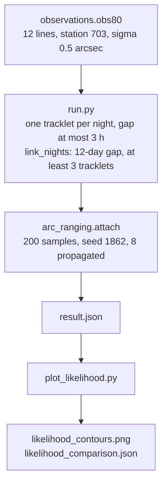

# (1862) Apollo: observations to an element distribution



Twelve public MPC observations of (1862) Apollo, all from station 703
(Catalina Sky Survey), through the night linker to a distribution of
a, e, i and q.  The numbers below are copied from `result.json`, which
`run.py` writes.

## Data

`observations.obs80` is twelve 80-column lines.  They are the station-703
rows of the MPC get-obs archive for designation 1862 with MJD from
59250.364046 to 59256.414017 (2021-02-05T08:44:13.574 to
2021-02-11T09:56:11.069, span 6.049971 days).  The rest of that archive
is not stored here.  Two of the twelve lines have a blank magnitude.

Station 703 in the MPC observatory list is the University of Arizona
Catalina Sky Survey (longitude 249.26736 deg, rho cos 0.845311, rho sin
0.533211).  On a machine that does not already have
`~/.ds9/ephem/ObsCodes.html`, `moving.obs.obscodes` downloads that list.
The astrometric sigma is 0.5 arcsec (`moving/obs.py`,
`DEFAULT_SIGMA["703"]`).

## Run

From the OGFinder root, with the thread cap the script also sets:

```bash
flock /tmp/astrafex_heavy.lock python examples/apollo_1862_ranging/run.py
```

The script builds one tracklet per night (four observations, gap at most
3 h), calls `moving.nightlink.link_nights` (max gap 12 days, at least
three tracklets), then `moving.arc_ranging.attach` with 200 samples,
seed 1862, and 8 samples propagated.  This run took 0.53 s to link and
29.9 s for the distribution and the propagation.

The nightlink command-line tool is not the command this example
reproduces.  It replaces every tracklet's station with one `--obs-code`,
and a tracklet file without a sigma uses `--nl-sigma` (default 0.3 arcsec).

## Result

Three tracklets, nights 59250, 59251 and 59256, arcs 0.413 h, 0.382 h
and 0.378 h.  One group, no pairs, nothing left unlinked.  The two-body
point fit is unchanged by the distribution.  Its elements are osculating
at MJD 59250.372643 (2021-02-05T08:56:36.334): a = 1.4842 AU, e = 0.5849,
i = 6.5088 deg, q = 0.6161 AU, heliocentric distance 2.2022 AU.
chi2/dof = 0.3872, rms = 0.3201 arcsec, largest normalised residual 1.074.

The arc is longer than a day, so the reported cloud is the local Laplace
sample of the 6-parameter fit (200 of 200 draws, mode rms 0.3202 arcsec,
chi-squared 9.8398).  The sample epoch is the mean observation time,
MJD 59252.725817, which is not the two-body epoch.  Quantiles 16/50/84%:

| element | 16% | 50% | 84% |
|---|---:|---:|---:|
| a (AU) | 1.4721 | 1.4846 | 1.4997 |
| e | 0.5632 | 0.5850 | 0.6072 |
| i (deg) | 6.3714 | 6.5103 | 6.6612 |
| q (AU) | 0.5875 | 0.6156 | 0.6426 |

The mode is a = 1.4844 AU, e = 0.5853, i = 6.5112 deg, q = 0.6156 AU.
The only class key is NEO.  The 16–84% width in a is 0.0276 AU.

108 of the 200 draws pass the likelihood ratio 0.001.  CODES propagated
8 of those (none failed) to the last observation, MJD 59256.414017.
Backend `codes`, force model `CODES Fortran real33 + DE440s + SB441-N16 + full 1PN + J2/J4/J6`.
Propagated quantiles 16/50/84%: a = 1.4739 / 1.4833 / 1.4938 AU,
e = 0.5651 / 0.5843 / 0.5989, i = 6.3752 / 6.5112 / 6.5974 deg,
q = 0.5939 / 0.6107 / 0.6303 AU.

JPL SBDB (`https://ssd-api.jpl.nasa.gov/sbdb.api?sstr=1862&full-prec=true`),
solution date 2026-08-31, is a different fit: 3701 observations from
1930-12-13 to 2026-04-15, rms `.458`, condition code 0, comment
`Nongravitational accels. using nonstandard g(r) = (1 au/ r)^2`.
Epoch JD 2461200.5 TDB, which the script converts to UTC
2026-06-08T23:58:50.815.  Elements at that epoch, copied as published:
a = `1.470715141636512` au, e = `.5601800481295997`,
q = `.6468498628096396` au, i = `6.352178986018433` deg.
They are not subtracted from the two-body fit or from the Laplace sample.

## Likelihood contours

```bash
python examples/apollo_1862_ranging/plot_likelihood.py
```

This repeats the 200 Laplace draws (seed 1862; the semimajor-axis quantiles match `result.json`) and writes `likelihood_contours.png` and `likelihood_comparison.json`. The contours are a Gaussian kernel density of those draws. The solid line encloses the densest 68% of the draws and the dashed line encloses 95%.

The marker is the JPL Horizons heliocentric ICRF state at the sample instant, MJD 59252.725817 UTC (2021-02-07T17:25:10.574), requested as TDB JD 2459253.226618. Elements come from `kepler.state_to_elements`, the same ecliptic rotation as the sample. Horizons at that instant: a = 1.47034 AU, e = 0.55997, i = 6.35490 deg, q = 0.64700 AU. Horizons minus the Laplace mode: Δa = −0.01407 AU, Δe = −0.02532, Δi = −0.15635 deg, Δq = +0.03139 AU.

The Horizons point is outside the 68% contour and inside the 95% contour in the (a, e) plane. It is inside both contours in the (a, i) and (q, e) planes. The one-dimensional 16–84% interval in a, 1.4721–1.4997 AU, does not contain 1.47034 AU. The SBDB elements at JD 2461200.5 are not this marker.

## Limits

The sampler is the local Gaussian sample in `moving/arc_ranging.py`.
It is not OpenOrb and it does not write `.sor` or `.orb` files.
A missing CODES tree leaves the two-body distribution in place
(`codes.status` = `unavailable`).  CODES is not part of this repository.
Area-to-mass is 0 on that propagation, and the eight samples stop at the
last observation.  They are not propagated to the JPL epoch.
