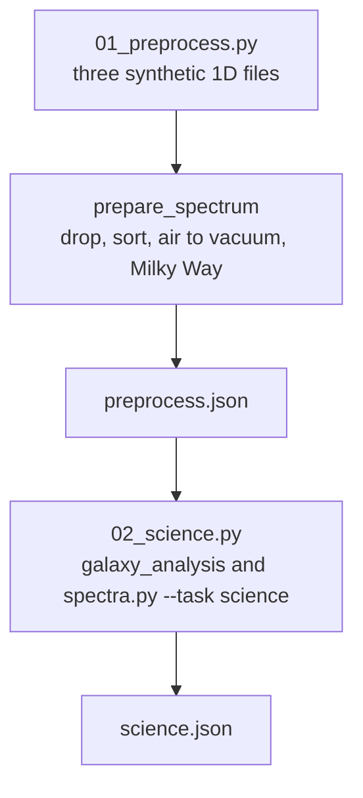
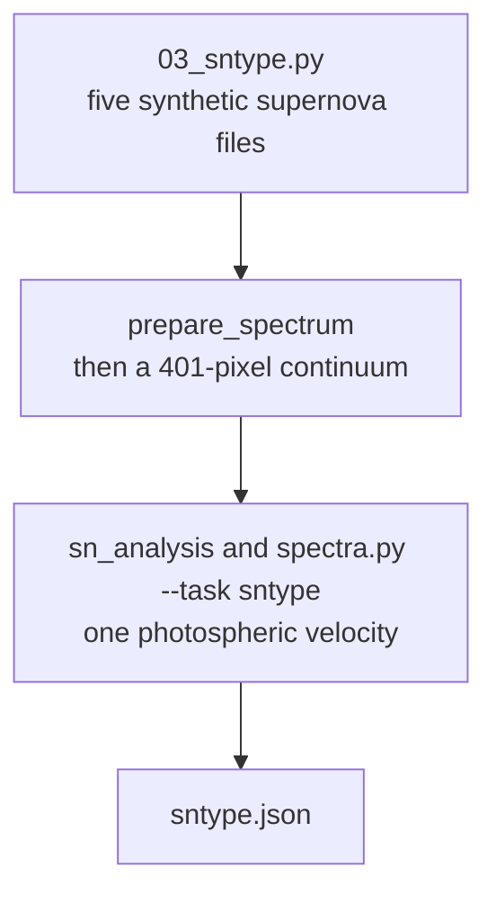

# Spectrum preprocessing and the science step



Three synthetic spectra, not a catalogue sample.  Object 1 is a star-forming
galaxy written in air wavelengths with two bad rows.  Object 2 is a star
plus one emission line.  Object 3 is C IV, C III] and Mg II at redshift 1.6.
The numbers below are copied from `preprocess.json` and `science.json`.

Flux stays in the file unit of the generator.  The H-alpha rate applies
the Murphy et al. 2011 constant to that number.  These files are not in
erg/s/cm^2, so the rate is not a physical star-formation rate.

## Run

From the OGFinder root:

```bash
python examples/spectra_science/01_preprocess.py
python examples/spectra_science/02_science.py
```

`02_science.py` calls `plugins/spectra/spectra.py --task science` once per
file.  The desktop step uses one parameter set for every catalogue row.
This example sets the frame, the redshift limit and the detection threshold
per file, because the three files are different demonstrations.  The menu
is Measure, Spectra, "Measure redshift, type, dispersion, SFR".

## Preprocessing

`ogfkit.specscience.prepare_spectrum` drops a sample whose wavelength or
flux is not finite, or whose error is not finite or is not positive.  It
sorts by wavelength, converts air to vacuum when asked, and, when Milky Way
E(B-V) is positive, multiplies flux and error by 10^(0.4 A) on the
Cardelli, Clayton and Mathis 1989 curve (Rv = 3.1).  Pixels outside that
curve are left unchanged.

Object 1 in `preprocess.json`: 3002 numeric rows, 2 dropped, 3000 kept.
The file starts at air wavelength 8396.6924.  After preprocessing the
vacuum grid runs from 5400.000001609707 to 8398.999998231964.

The same file records air 6562.801 converted to vacuum 6564.613980268717,
and a three-pixel dereddening at E(B-V) = 0.1.

## Measurements

`galaxy_analysis` then finds the continuum, emission and absorption lines,
and a C IV / C III] / Mg II redshift.  Solutions within 1500 km/s stay
together and an emission solution of quality 2 or 3 is kept.  A quality-1
emission redshift does not replace a stronger absorption redshift at a
different redshift.

| object | catalogue type | z column | source | sigma (km/s) |
|---|---|---|---|---|
| 1 | star-forming | 0.199999 | emission | 84.9945 gas |
| 2 | star | 0.000199877 | absorption | 76.4154 stellar |
| 3 | broad-line AGN | 1.6001 | uv | 1607.43 gas |

Object 2 also has an emission redshift 0.20727869898813434 of quality 1
(one line).  The adopted redshift is the absorption solution, quality 3,
eight lines.  Object 3's broad line is C IV at 3853.396438721958 km/s.
The 1200 km/s number for H-alpha and H-beta is Hao et al. 2005.  C IV,
C III] and Mg II use that same width cut.

## Supernova type



`03_sntype.py` writes `data/sn_1.txt` through `data/sn_5.txt` and
`sntype.json`.  All five are vacuum, host redshift 0.05, and the file unit
of the generator.  The menu is Measure, Spectra, "Supernova type".  One
CLI call covers the catalogue, because these files share a frame.  The
continuum width is 401 pixels inside the program.  The galaxy steps keep
the menu continuum width of 101.

| file | drawn | SN_TYPE | SN_V | SN_VLINE |
|---|---|---|---|---|
| sn_1 | Ia, Si II 0.55 at 10000 km/s | Ia | 10165.9 | SiII6355 |
| sn_2 | II, H-alpha 0.45 and H-beta 0.30 at 8000 km/s | II | 8082.27 | Ha |
| sn_3 | Ib, three He I lines at 9000 km/s | Ib | 8783.41 | HeI5876 |
| sn_4 | O I and Si II 0.25 at 32000 km/s | Ic-BL | 31491.2 | OI7774 |
| sn_5 | narrow H-alpha, sigma 400 km/s | IIn | -1.8121 | Ha |

Object 1 keeps a(Si) = 0.5565521063747747.  Object 4 keeps a(Si) =
0.15133394936015276, below 0.35, and an O I velocity of
31491.243003132528 km/s, so the rules call it Ic-BL.  Object 5 has narrow
H-alpha FWHM 938.137164051744 km/s.  The same `sn_2.txt` with an empty
redshift column is type unknown, quality 0.  A host redshift is required.
Supernova line velocities are not used as a redshift.
